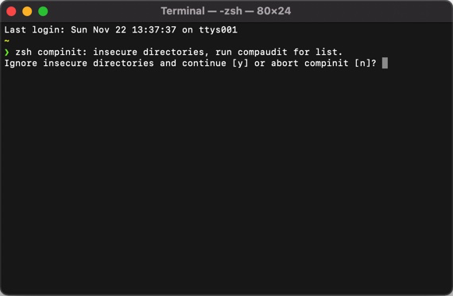

# Tsutomu-Ikeda/settings
設定ファイル一覧です。

## zshの使用方法
以下のセットアップ方法は [Laica-Lunasys/dotfiles](https://github.com/Laica-Lunasys/dotfiles) を参考にして作りました。[@Laica-Lunasys](https://github.com/Laica-Lunasys) さんありがとうございます。

### お試しで使う
既存環境を汚したくない場合におすすめの方法です。[Docker Hubにビルドされたイメージ](https://hub.docker.com/r/tomtsutom/zsh-sample) が上がっています。以下のコマンドを打つことで動作を確かめることができます。<br>
なお、dockerの環境構築が済んでいない方は [dockerのインストール](https://www.docker.com/get-started) から行ってください。

```bash
docker run --rm --name tomtsutom-zsh -e TZ=Asia/Tokyo -v $PWD:/home/host-machine -it tomtsutom/zsh-sample
```

### インストールする

```bash
git clone https://github.com/Tsutomu-Ikeda/settings
cd settings/unix/setup
make install
```

### こんな警告が出たら...



compauditコマンドで警告が出ているファイル一覧を取得し、警告が出ているファイル全部に

```bash
chmod 755 `警告が出ているファイル`
```

例)

```bash
chmod 755 /usr/local/share/zsh
chmod 755 /usr/local/share/zsh/site-functions
```

というコマンドを実行すると、解決できます。

参考: https://qiita.com/ayihis@github/items/88f627b2566d6341a741

### fishから移行する
fish_historyからzsh_historyを生成するコマンドを用意しています。必要に応じて使ってください。
**なお、zsh_historyは上書きされます。残しておきたい情報がある場合バックアップをとってから実行してください。**

```bash
cd unix/setup
make migrate-from-fish
```
